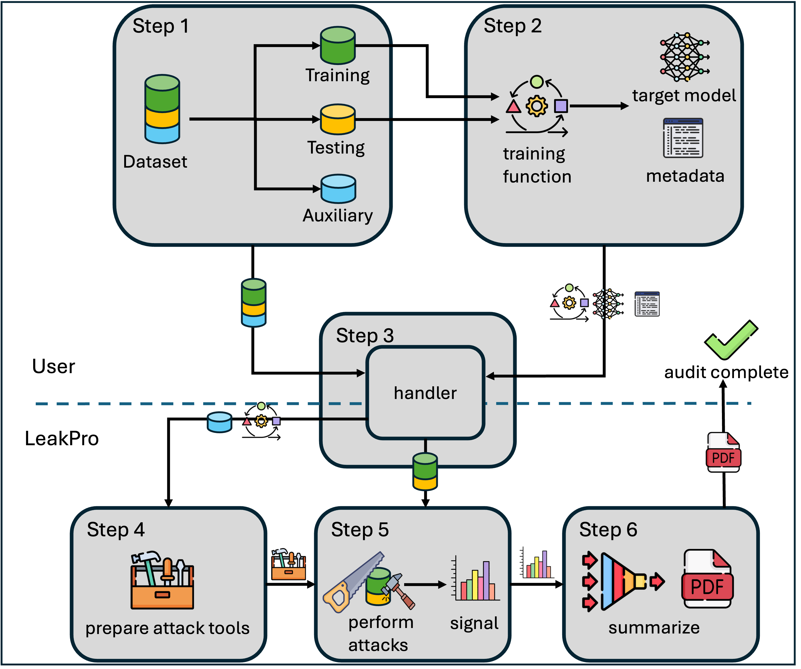

# LeakPro

## About the project
The goal of LeakPro is to enable practitioners to seamlessly estimate the risk of leaking sensitive data when sharing machine learning models or synthetic datasets. 
LeakPro was created to bridge the gap between technical risk and legal risk, a challenge faced by many organizations today.
To achieve this, LeakPro provides tools to stress-test machine learning models and synthetic data by performing state-of-the-art privacy attacks. These include membership inference attacks, reconstruction attacks, and other advanced methods that assess the potential for sensitive information leakage.

The results are automatically collected, summarized, and presented in a comprehensive PDF report. This report is designed for easy sharing with stakeholders and to provide a solid foundation for risk assessment, compliance documentation, and decision-making around data sharing and model deployment.

## Privacy auditing

### Membership Inference Attacks (MIA)
 

In the figure above, the MIA workflow is outlined. The upper part of the image (above the dashed line) shows user-controlled inputs, while the lower part illustrates the inner workings of LeakPro.
To evaluate MIAs using LeakPro, the following steps are necessary:

- **Step 1:**  Ensure access to an auxiliary dataset, which may originate from the same distribution as the training dataset or a different one. The figure above illustrates the former case.
Additionally, the user must split the dataset into a training set and a test set. The training set is used for model training, while the test set is used to assess the generalization gap. During evaluation, the attack will be tested on both training samples (in-members) and testing samples (out-members).
The complete dataset (including the training, test, and auxiliary sets) will be provided to LeakPro and referred to as the population data.
Importantly, the population dataset must be indexable.

- **Step 2:** The user must provide a function to train a model using the training set. This function can either be used to train a target model or be bypassed if a pre-trained target model is provided. Regardless, the user must supply training functionality to enable the adversary to train shadow models during the evaluation process.
It is important to note that this training functionality can be designed to limit the adversary's knowledge, as the training process may differ from the actual model training used in practice.
Additionally, along with the target model, the user should provide the following metadata:
    - Training and testing indices within the population data.
    - The optimizer function used during training.
    - The loss function applied during model evaluation.

- **Step 3:** The user-provided inputs–population data, target model, target model metadata, and the training function–are supplied to LeakPro when the LeakPro object is created. This information is stored within the Handler object, which acts as an interface between the user and the various attacks performed by LeakPro.

- **Step 4:** The relevant attacks are prepared within LeakPro, utilizing different tools based on the specific attacks being performed. For instance, some attacks rely on shadow models, while others leverage techniques such as model distillation or quantile regression.
These tools are built using the auxiliary data, which is assumed to be accessible to the adversary, along with the training loop provided by the user.

Additionally, certain attacks feature both online and offline versions:
    - Offline attacks: The adversary can only sample from the provided auxiliary dataset, limiting access to other data sources.
    - Online attacks: The adversary can also sample from the training and test datasets, though without knowing whether specific samples were used during the training of the target model.

- **Step 5:** The attack tools are utilized during attack execution to generate signals for membership inference. The membership inference attacks are evaluated on both the training and test datasets. The adversary's objective is twofold:

    - Correctly infer that the training data samples are in-members (part of the training set).
    - Accurately detect that the test data samples are out-members (not part of the training set).

- **Step 6:** The signals generated by each attack, along with the corresponding decisions, are passed to LeakPro's report module for summarization. The report module compiles the results into a comprehensive PDF report for easy sharing while also storing the individual data outputs produced by the attacks for further analysis.
Once the results have been generated and stored, the auditing process is considered complete.

## Real world examples

Our industry use cases cover four distinct data modalities: tabular, image, text, and graphs. Each use case supports various types of privacy attacks, providing a comprehensive evaluation framework.

<table>
  <tr>
    <td align="center" width="400" height="200">
      <strong>Length-of-stay Prediction</strong> 
      
       
      <a href="length-of-stay.md">length-of-stay.md</a>
      

        Membership Inference: ✅ 
        Federated learning: ✅ 
        Synthetic data: ✅
      

    </td>
    <td align="center" width="400" height="200">
      <strong>Text Masking</strong> 
      
       
      <a href="text-masking.md">text-masking.md</a>
      

        Membership Inference: ✅ 
        Federated learning: ✅ 
        Synthetic data: ✅
      

    </td>
  </tr>
  <tr>
    <td align="center" width="400" height="200">
      <strong>Camera Surveillance</strong> 
      
       
      <a href="surveillance.md">surveillance.md</a>
      

        Membership Inference: ✅ 
        Federated learning: ✅ 
        Synthetic data: ❌
      

    </td>
    <td align="center" width="400" height="200">
      <strong>Molecule Property Prediction</strong> 
      
       
      <a href="molecule-property.md">molecule-property.md</a>
      

        Membership Inference: ✅ 
        Federated learning: ❌ 
        Synthetic data: ❌
      

    </td>
  </tr>
</table>

## To install
0. **Clone repository**
`git clone https://github.com/aidotse/LeakPro.git`
1. **Navigate to the project repo**
`cd Leakpro`
2. **Install with pip**
`pip install -e .`

## To Contribute
0. **Ensure local repo is up-to-date:**
`git fetch origin`
2. **Create feature branch**
 `git checkout -b my-feature-branch`
3. **Make changes and commit:**
`git add . ` 
`git commit -m "Added new feature" `
4. **Ensure the local main is up to date:**
`git checkout main`
`git pull origin main`
5. **Merge main onto feature branch**
`git checkout my-feature-branch`
`git merge main`
6. **Resolve conflicts, add and commit.**
7. **Push your update to the remore repository**
`git push origin my-feature-branch`
8. **Open pull request**
